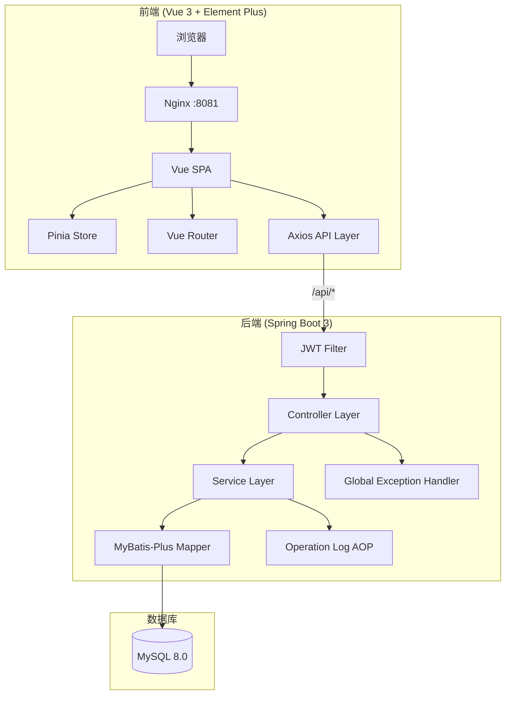
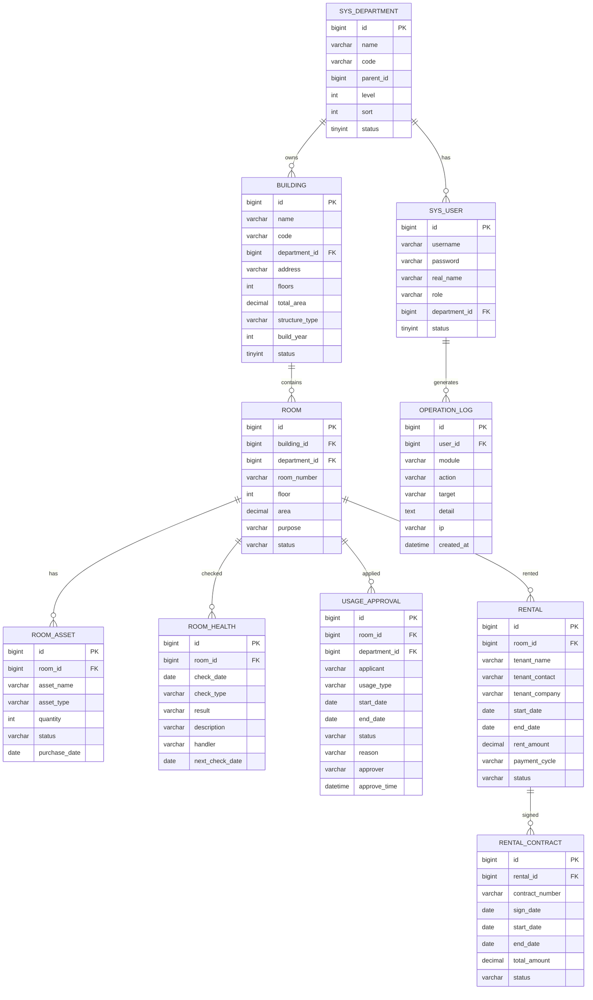

# 楼宇管理系统 - 项目设计文档

## 1. 系统架构

## 2. ER 图

## 3. 接口清单

### AuthController `/api/auth`
| 方法 | 路径 | 说明 |
|------|------|------|
| POST | /login | 登录获取 JWT Token |
| GET | /info | 获取当前用户信息 |

### BuildingController `/api/buildings`
| 方法 | 路径 | 说明 |
|------|------|------|
| GET | / | 楼宇列表（分页、条件查询） |
| POST | / | 新增楼宇 |
| PUT | /{id} | 修改楼宇 |
| PUT | /{id}/status | 变更状态 |
| DELETE | /{id} | 删除楼宇 |

### RoomController `/api/rooms`
| 方法 | 路径 | 说明 |
|------|------|------|
| GET | / | 房屋列表（多维度查询） |
| POST | / | 房屋登记 |
| PUT | /{id} | 变更修改 |
| PUT | /{id}/status | 变更状态 |
| DELETE | /{id} | 删除房屋 |

### RoomAssetController `/api/room-assets`
| 方法 | 路径 | 说明 |
|------|------|------|
| GET | / | 按房间查询资产 |
| POST | / | 新增资产 |
| PUT | /{id} | 修改资产 |
| DELETE | /{id} | 删除资产 |

### RoomHealthController `/api/room-health`
| 方法 | 路径 | 说明 |
|------|------|------|
| GET | / | 健康记录列表 |
| POST | / | 新增检查记录 |
| PUT | /{id} | 修改记录 |

### UsageApprovalController `/api/approvals`
| 方法 | 路径 | 说明 |
|------|------|------|
| GET | / | 审批列表 |
| POST | / | 提交使用申请 |
| PUT | /{id}/approve | 审批通过 |
| PUT | /{id}/reject | 审批驳回 |

### RentalController `/api/rentals`
| 方法 | 路径 | 说明 |
|------|------|------|
| GET | / | 租赁列表 |
| POST | / | 新增租赁 |
| PUT | /{id} | 修改租赁 |
| PUT | /{id}/terminate | 终止租赁 |
| GET | /{id}/contracts | 合约列表 |
| POST | /{id}/contracts | 新增合约 |

### StatisticsController `/api/statistics`
| 方法 | 路径 | 说明 |
|------|------|------|
| GET | /dashboard | 首页概览数据 |
| GET | /rooms | 房屋信息统计 |
| GET | /usage | 使用情况统计 |
| GET | /rental | 租赁收益统计 |

### SysUserController `/api/users`
| 方法 | 路径 | 说明 |
|------|------|------|
| GET | / | 用户列表 |
| POST | / | 新增用户 |
| PUT | /{id} | 修改用户 |
| DELETE | /{id} | 删除用户 |
| PUT | /{id}/reset-password | 重置密码 |

## 4. UI/UX 规范

| 属性 | 值 |
|------|------|
| 主色调 | #1890FF（科技蓝） |
| 成功色 | #52C41A |
| 警告色 | #FAAD14 |
| 危险色 | #FF4D4F |
| 顶部导航高度 | 60px |
| 侧边栏宽度 | 220px / 折叠 64px |
| 内容区背景 | #F0F2F5 |
| 卡片背景 | #FFFFFF |
| 卡片圆角 | 8px |
| 按钮圆角 | 4px |
| 间距体系 | 8px / 16px / 24px |
| 字体 | -apple-system, BlinkMacSystemFont, 'Segoe UI', sans-serif |
| 基准字号 | 14px |
| 图表库 | ECharts 5.x |
